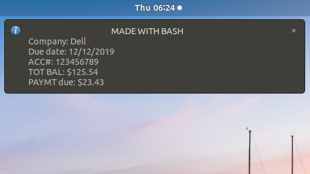

# Payup-vBash
Payup -vBash is, mostly, the same program initially written in C and Python called Payup. A bill notifier for your personal PC.
By: Wali Morris 
12/26/2019

Payup -vBash is the same program I first wrote with C and Python, but after reviewing the program I decided it could be
written completely with a bash scipt that's not only less code, simple, but also much more efficient. This time, I used 
a legendary terminal GUI program called dialog for assistance. Dialog is really light-weight, easy to use, and a great 
way to produce simple GUIs for the Linux command line(depending on what you're actually using it for, that is). 

**HOW TO**
Payup -vBash was made to be a small and easy to use program. From the beginning, there are some small processes run to 
automate setting up dialog if it's your first time running the program and setting up bill notifications. Set-up will 
be taken care of by answering a few short question. 

If this is your first time or you want to run a quick update before creating a new bill notification, things will run 
on their own from there. 

You can decide to skip this install and update all together, either way you'll be notified and prompted to continue 
with setting up your bill. You'll also have the decision to keep the old bill or create a new one. If you create a 
new bill, you'll be asked to input the bill information in boxes like these: 

Payup -vBash notifications are setup by saving input information into a filed called tui.txt, this can be changed to 
anything by editing the bash script. If a bill is updated then tui.txt will be overwritten, otherwise all bill info 
will remain the same until it's updated. The notification is almost identical to the the original Payup program. 

